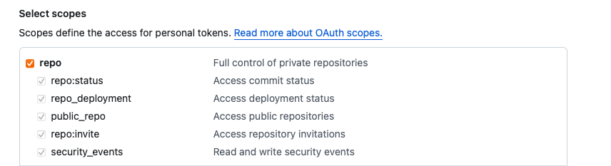
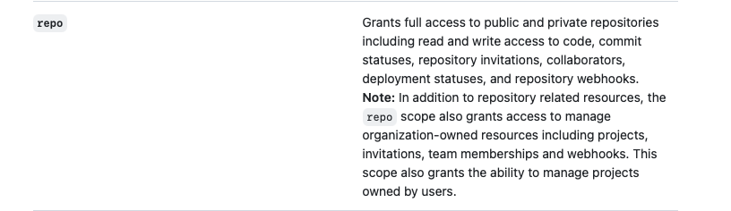
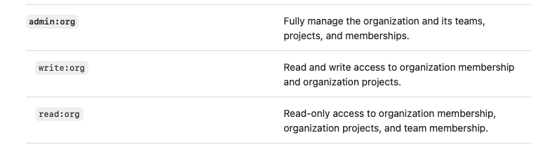

+++
title = "Be careful using GitHub PAT with `repo` scope"
date = 2025-06-26T15:38:30+08:00
header_img = ""
toc = false
tags = ["GitHub","PAT"]
categories = ["GitHub"]

+++


Did you know that when you're using a Github personal access token (PAT) with the ```repo``` scope, it gives you more permissions than just accessing your repositories? If not, you should take a look into this blog post. 

## What is a GitHub PAT?
A classic GitHub PAT gives you the possibility to authenticate using a token against Github, and it's going to impersonate as your user account. Depending on the chosen scope, you can do multiple things with these token. For example read repository content, write to repository, etc. To create a classical personal access token, you have to go to your [developer settings of your personal account](https://github.com/settings/tokens?type=classic). 


## What is the issue with the repo scope token? 
I was currently working for a customer and they wanted to migrate from GitHub Enterprise Server to GitHub Enterprise Cloud. Therefore we have tooling in place like the [GitHub Enterprise Importer (GEI)](https://docs.github.com/en/migrations/using-github-enterprise-importer). One downside of the tooling is, it will not migrate teams, users, repo permissions, etc. So that was the reason I created some post-migration scripts to do the work and with this I noticed something weird. I only had a `repo` scope token per accident but wanted to create a team for the organization. And guess what? It worked... 😵‍💫

I was confused and checked my token, looked like this



Looks pretty clean here. No hints for additional permissions, right? 

I played around a little bit and came to the conclusion that has to be a bug 💪. My PAT doesn't have `admin:org` scope, so that shouldn't work. Following this up I created a support ticket on GitHub just to get the confirmation `this is by design`. True to the motto: `"It is not a bug, it is a feature"`. What the hell! 🤯
They pointed me to the [docs](https://docs.github.com/en/apps/oauth-apps/building-oauth-apps/scopes-for-oauth-apps#available-scopes) where it is outlined as well:



Well, this is some kind of misleading, isn't it? You have the `admin:org` scope for exactly this scenarios:



But some of these resources are included by design in the `repo` scope, too. Why GitHub, WHY?!?!


## Conclusion
I think this is still a bug and should be fixed. Yes, this may cause some integrations to stop working but it will definitely increase security and predictability. But it is more consistent to use the `org:admin` scope to handle organization resources instead the `repo` scope. Using the GitHub API with classic PAT shows some other strange behaviors but this is a topic for another blog post.

So next time you give a person or tool your "just" `repo` scope token keep in mind that it can be used to modify organization level resources likes teams, projects, etc. For sure you can use this on purpose to work with lower privileges than necessary 😁