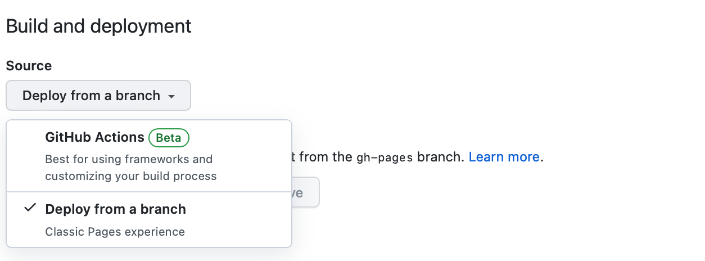

+++
title = "Build and Deploy Hugo Sites With GitHub Actions"
date = 2022-11-28T16:38:30+08:00
header_img = ""
toc = true
tags = ["GitHub", "Hugo", "GitHub Pages"]
categories = []
# series = ["Themes Guide"]
+++

When you host your [hugo](https://gohugo.io) site in a GitHub repository the default way to deploy it to GitHub Pages is using a dedicated branch, like described [here](https://gohugo.io/hosting-and-deployment/hosting-on-github/). After following the instructions your settings should look like this:

But now there is a easier way to achieve the same goal without handling with additional workflows and branches (currently in Beta). You can change the source of deployment here:

After changing to GitHub Actions you can create a workflow on a prepared template for Hugo or you take a look [here](https://github.com/spindev/spindev.github.io/blob/main/.github/workflows/hugo.yml). After commiting your new workflow you can delete your old build workflow and your deployment branch. 

Now you have only one CI/CD workflow for building and deploying your hugo site to GitHub Pages. Awesome :)